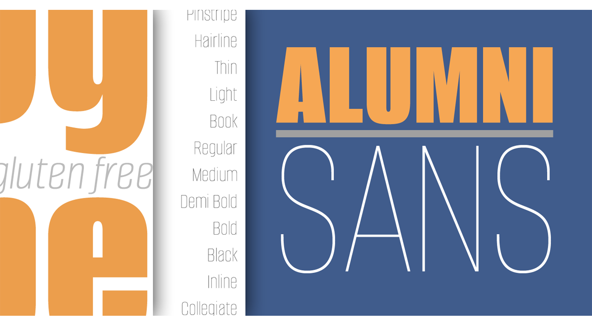

# Alumni Sans

Originally inspired by the black face Impact™, it soon evolved to include numerous weights from the Black flavor of its progenitor to a super Thin weight.

The extreme weights (Thin and Black) are designed for display situations while the remaining weights may be used for more traditional textual design applications.



## Building the Fonts

The font is built using fontmake and gftools post processing script. Tools are all python based, so it must be previously installed.

To install all the Python tools into a virtualenv, do the following:

From terminal:

```

cd your/local/project/directory

#once in the project folder create a virtual environment. 
This step has to be done just once, the first time:

python3 -m venv venv

#activate the virtual environment

source venv/bin/activate

#install the required dependencies

pip install -r requirements.txt

```

Then run the this command:

```
cd sources
gftools builder config.yml
```


## Changelog

**8 Dec 2021. Version 1.018**
- MINOR GF Latin Plus added. Accents created for Small Caps.

**19 Jun 2021. Version 1.015**
- MINOE Glyphset meets now Google Font Plus encoding

## License

This Font Software is licensed under the SIL Open Font License, Version 1.1.
This license is copied below, and is also available with a FAQ at
https://scripts.sil.org/OFL